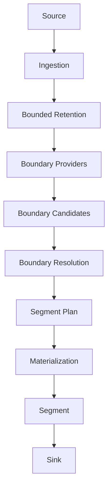
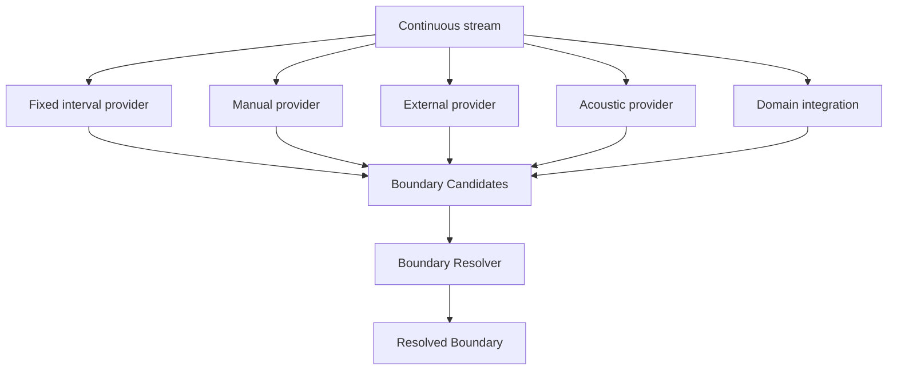
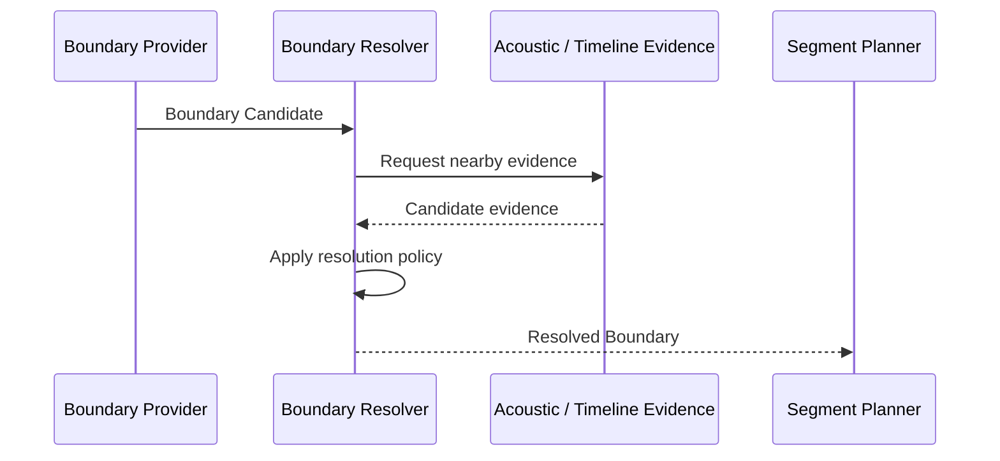
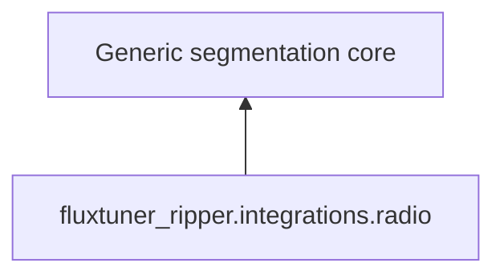
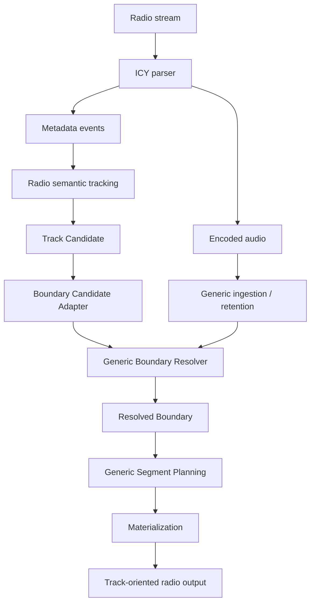
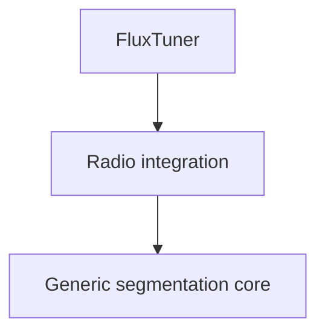

# Architecture

FluxTuner Ripper is a boundary-driven continuous-stream segmentation engine.

Its core responsibility is deliberately narrow:

> Incrementally consume a continuous encoded stream, retain only the working
> data required for segmentation, resolve pluggable boundary signals, and
> materialize bounded segments without requiring source-specific semantics.

Audio is the current media domain. Radio ripping is implemented as a first-party
integration on top of the generic engine.

The architecture follows one central rule:

> Domain-specific concepts enter the engine through generic boundary contracts.

The engine may consume intelligence about where a segment boundary exists, but
it does not own the semantic meaning of that boundary.

For formal definitions of the core vocabulary used throughout this document,
see [`concepts.md`](concepts.md).

For the behavioral guarantees and explicit non-guarantees of the engine, see
[`guarantees.md`](guarantees.md).

For guidance on implementing providers, resolvers, materializers, sinks, domain
integrations, and external adapters, see
[`extensions.md`](extensions.md).

For reproducible examples and validated real-world use cases, see
[`examples/README.md`](examples/README.md).

## Architectural overview



The pipeline is intentionally split into independent responsibilities.

## Source

A source provides incremental bytes and transport-level information.

The core does not require the source to be a radio station, file, pipe, network
stream, or any other specific origin.

Examples include:

- files
- stdin
- HTTP streams
- application-provided streams
- future non-radio continuous sources

The generic abstraction is `StreamSource`.

## Ingestion

Ingestion incrementally consumes the encoded stream and establishes the timeline
needed by the rest of the engine.

For the current audio domain this includes operations such as:

- incremental encoded reads
- MP3 frame parsing
- AAC/ADTS frame parsing
- encoded offset tracking
- mapping encoded offsets to media time

Ingestion does not decide where semantic segments begin or end.

## Bounded retention

Continuous streams cannot be treated as unbounded in-memory objects.

The engine therefore maintains only the data required by the current working
window.

The current implementation combines:

- a bounded in-memory ring for analysis-sensitive data
- a reclaimable disk spool for encoded data that may still be required for
  future materialization


Retention is part of the engine contract rather than an implementation accident.

The goal is to allow continuous processing while keeping memory usage bounded
and reclaiming retained encoded data when it can no longer contribute to a
future segment.

## Boundary model

Segmentation is driven by boundaries rather than source-specific concepts such
as songs, programmes, speakers, incidents, or station metadata.

A boundary provider proposes possible segmentation points.



This distinction is important:

- a **Boundary Candidate** is a proposal
- a **Resolved Boundary** is the engine's accepted segmentation decision

Providers may be deterministic, externally supplied, algorithmic, or informed
by another system.

The engine does not need to understand why a provider considers a boundary
meaningful.

## Boundary providers

A boundary provider is an extension point for supplying candidate boundaries.

Current generic providers include:

- fixed intervals
- manually supplied timestamps
- external JSON/JSONL boundaries

Additional providers can be implemented without changing the core segmentation
model.

Examples of potential providers include:

- acoustic transition detection
- speech diarization
- ASR-derived events
- scene-change detection
- external sensors
- AI or perception systems
- application-specific event detectors

These systems determine **where** something relevant may have happened.

They remain outside the engine when they determine **what that event means**.

## Boundary resolution

Candidate generation and boundary resolution are separate concerns.

A provider may produce an approximate, semantic, or externally observed
timestamp. The resolver is responsible for converting candidate evidence into
a usable segmentation boundary.

For the current audio implementation this may involve aligning an approximate
candidate with encoded-frame or acoustic evidence.



The resolver operates on generic boundary contracts. Domain integrations may
adapt their own semantic events into those contracts before resolution.

## Segment planning

Resolved boundaries are converted into segment plans.

A segment plan describes which retained encoded range belongs to a segment
without yet requiring that range to be written as a final file.

This separation allows planning and persistence to evolve independently.

The current audio implementation supports concerns such as:

- encoded byte-range calculation
- frame-safe cuts
- crossfade-aware range planning
- final-tail handling

## Materialization

Materialization turns a segment plan into bounded output.


For the current media domain this includes:

- direct encoded writing where appropriate
- streaming MP3 finalization
- streaming AAC/ADTS to M4A finalization
- atomic output persistence

The generic engine concept is the **Segment**.

A track is a radio-domain interpretation of a segment, not a core abstraction.

## Core and integrations

The dependency direction is deliberately one-way.



The core must not depend on:

- ICY
- StreamTitle
- stations
- tracks
- radio metadata
- FluxTuner application concepts

This architectural constraint is enforced by tests.

The radio integration may freely depend on generic engine components.

## First-party radio integration

The radio implementation lives under:

```text
fluxtuner_ripper.integrations.radio
```

Its current responsibilities include:

- incremental ICY metadata parsing
- mapping metadata events onto the encoded timeline
- metadata semantic tracking
- radio-specific track state
- transient/non-track interval handling
- adapting radio track candidates to generic boundary candidates
- radio-oriented orchestration
- track-oriented output naming and persistence
- the `fluxtuner-ripper` radio CLI

Conceptually:



`TrackCandidate` and other track terminology exist only inside the radio
integration.

The generic engine sees boundaries and segments.

## Relationship with FluxTuner

The engine originated inside FluxTuner's radio ripping workflow.

It has since evolved into an independent segmentation core whose architecture
does not depend on FluxTuner.

The intended dependency direction is:



FluxTuner is therefore a consumer and reference integration rather than the
owner of the engine's domain model.

## Generic CLI

The source-agnostic CLI is:

```text
fluxtuner-ripper-segment
```

It exposes generic segmentation operations without requiring radio semantics.

Current provider modes include:

- fixed
- manual
- external

Input can come from a file or stdin.

Depending on the requested mode, the CLI can report boundaries or materialize
segments.

## Radio CLI

The first-party radio CLI is:

```text
fluxtuner-ripper
```

It uses the radio integration and therefore understands concepts such as ICY
metadata and track transitions.

The existence of this CLI does not make those concepts part of the engine core.

## Machine-oriented API

The machine API provides structured contracts for applications, automation, and
agent-oriented workflows.

Its purpose is to expose the segmentation engine through deterministic,
machine-readable boundaries rather than through radio-specific behavior.

The current entry points are:

- `segment_source`
- `run_segment_source`
- `run_segment_json`

This API is intended to remain aligned with the generic engine architecture.

## Agent and external-intelligence integration

The architecture deliberately allows external systems to provide boundary
signals.

An AI agent, model, detector, or perception system can decide that a relevant
event occurred at or near a particular time and provide that observation as a
boundary candidate.


This creates a useful separation of responsibilities:

- external intelligence interprets the stream
- the segmentation engine preserves and materializes the corresponding bounded
  source evidence

The engine therefore does not need to become an inference platform.

## Architectural invariants

The following rules define the intended architecture:

1. The engine is boundary-driven, not track-driven.
2. Ingestion and boundary detection are separate responsibilities.
3. Candidate generation and boundary resolution are separate responsibilities.
4. Retention must remain bounded.
5. Segmentation is independent from source-specific semantics.
6. Domain integrations depend on the core; the core never depends on them.
7. `Segment` is a core concept. `Track` is a radio-domain concept.
8. External intelligence may provide boundary signals without becoming part of
   the engine.
9. Materialization operates on retained source data rather than requiring the
   complete stream in memory.
10. FluxTuner is a consumer of the engine, not part of the engine's domain model.

## Package layout

At a high level:

```text
fluxtuner_ripper/
    models.py
    boundaries.py
    providers.py
    orchestrator.py
    output.py
    source.py
    ingest.py
    buffer.py
    frames.py
    streaming_*.py
    generic_runner.py
    generic_output.py
    generic_cli.py
    machine.py
    ...

    integrations/
        radio/
            models.py
            icy.py
            metadata.py
            orchestrator.py
            ripping.py
            session.py
            session_output.py
            runner.py
            transient.py
            cli.py
```

The exact internal module layout may evolve, but the dependency boundary between
the generic engine and domain-specific integrations is intentional and should
remain stable.
