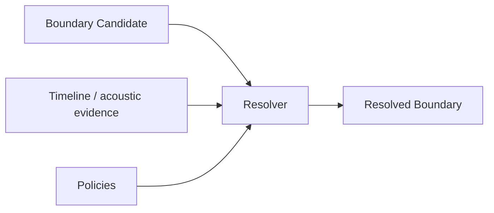
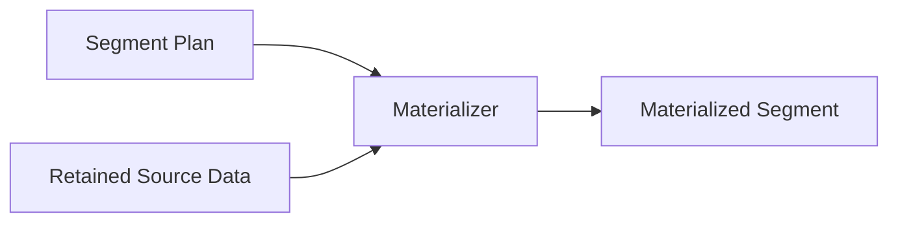
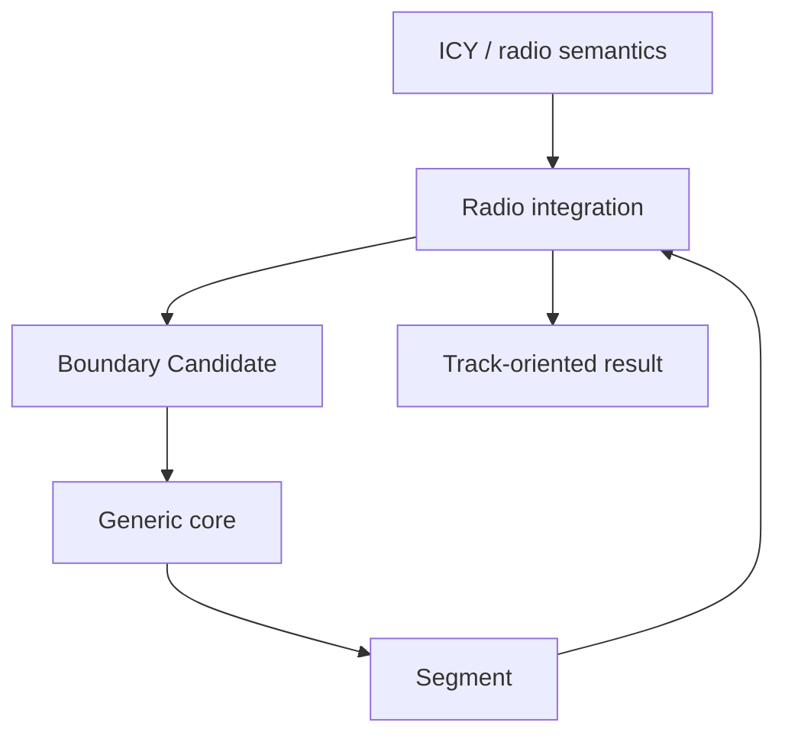

# Extension contracts

This document defines how Brynse should be extended without weakening
the generic segmentation architecture.

The core rule is:

> Extensions may provide evidence, policy, materialization behavior, or
> domain-specific adaptation, but they must not collapse those responsibilities
> back into a single source-specific pipeline.

The intended dependency direction remains:

```text
external system / domain integration
              ↓
      extension contract
              ↓
             core
```

The core must remain independent from domain-specific semantics.

## Boundary provider contract

A `BoundaryProvider` proposes candidate segmentation points.

Its responsibility is deliberately narrow:

> Produce normalized boundary candidates from one or more boundary signals.

A provider may consume:

- elapsed time
- user-supplied timestamps
- external events
- application state
- acoustic observations
- metadata
- AI or perception output
- sensor events
- domain-specific signals

A provider should produce generic boundary candidates rather than forcing the
core to understand the provider's source semantics.

### A provider should

- express possible segmentation points through generic boundary contracts
- preserve relevant timing or reference-offset information
- identify its candidate source where useful
- remain independent from output persistence
- allow the resolver to decide whether a candidate becomes a segmentation
  boundary
- expose deterministic behavior when the underlying provider is deterministic

### A provider should not

- control source ingestion
- retain unbounded source data
- write finalized segments
- decide output filenames
- bypass boundary resolution when resolution is required
- require the generic core to understand domain-specific concepts

Conceptually:


## Resolver contract

A resolver converts candidate evidence into operational segmentation decisions.

Its responsibility is:

> Decide whether and where a proposed boundary should become a resolved
> segmentation boundary.

A resolver may:

- accept a candidate as-is
- align a candidate with timeline evidence
- align with encoded-frame boundaries
- consult acoustic evidence
- apply temporal rules
- reject unsuitable candidates
- choose between nearby alternatives
- defer decisions when required evidence is not yet available

### A resolver should

- operate on generic boundary candidates
- return generic resolution results
- keep candidate generation separate from candidate resolution
- make rejection or deferral explicit
- preserve enough information for downstream planning where appropriate
- remain independent from domain-specific naming and persistence

### A resolver should not

- import radio, track, station, speaker, incident, or similar domain concepts
- fetch unrelated external semantic information
- materialize output
- own long-term retention
- reinterpret a segment's domain meaning

Conceptually:



### Temporal evidence contract

Providers, adapters, and resolvers should preserve the temporal meaning of their
evidence. An incoming onset, outgoing end, acoustic change, identity transition,
semantic cut, and metadata transition may occur at different instants.

An extension should therefore not collapse unlike timing semantics into one
undifferentiated timestamp merely because they refer to the same broad transition.
If a resolver combines multiple evidence families, the interpretation of each
family should remain explicit and independently testable.

Resolvers may also require future context. In that case deferral is preferable to
forcing a premature decision, and the surrounding runner must retain the bounded
source context required to settle the pending candidate.

## Policy contract

A policy constrains or influences deterministic engine behavior.

Policies are useful when candidate evidence must be interpreted according to
explicit rules.

Examples include:

- temporal split policy
- candidate acceptance thresholds
- final-tail handling
- transient exclusion
- crossfade-aware planning

A policy should be:

- explicit
- deterministic when its inputs are deterministic
- independently testable
- free from hidden domain-specific dependencies unless it belongs to a domain
  integration

A policy is not a provider.

A provider proposes possible boundaries.

A policy decides how evidence or plans should be treated.

## Materializer contract

A materializer turns a valid segment plan and retained source data into concrete
bounded output.

Its responsibility is:

> Produce one representation of the planned segment from retained source data.

A materializer may:

- copy encoded ranges
- finalize codec/container output
- perform required framing or container conversion
- produce a byte sequence
- produce a file-ready representation

### A materializer should

- consume an already-decided segment plan
- operate only on retained data required by that plan
- surface materialization failures explicitly
- avoid changing segmentation semantics
- remain independent from boundary generation

### A materializer should not

- decide where segment boundaries belong
- reinterpret provider signals
- own source ingestion
- depend on domain-specific concepts unless implemented inside a domain
  integration

Conceptually:



## Sink contract

A sink receives completed materialized segments.

Its responsibility begins after segmentation and materialization decisions have
already been made.

Possible sinks include:

- filesystem output
- object storage adapters
- queues
- application callbacks
- databases
- remote services
- downstream processing systems

### A sink should

- accept completed materialized output
- report persistence or delivery failures
- own sink-specific durability behavior
- remain downstream from segmentation

### A sink should not

- decide boundaries
- mutate core segmentation semantics
- require the core to understand sink-specific business meaning
- implicitly become permanent retention for the segmentation engine

The engine does not guarantee durability beyond the guarantees explicitly
provided by a sink implementation.

## Domain integration contract

A domain integration translates source-specific semantics into generic engine
contracts.

Examples of domain-specific concepts include:

- radio tracks
- programmes
- speaker turns
- incidents
- scenes
- alarms
- machine events
- sensor states

A domain integration may understand those concepts.

The generic core must not.

### A domain integration may

- parse source-specific metadata
- maintain domain-specific state
- classify domain events
- translate domain events into boundary candidates
- adapt generic segment output back into domain-specific results
- implement domain-specific policies
- provide domain-oriented CLIs or APIs

### A domain integration must

- depend on the generic core rather than the reverse
- adapt domain concepts into generic contracts at the boundary
- keep domain-specific vocabulary out of generic core modules
- avoid changing generic contracts solely for one integration
- remain removable without making the core unusable

The first-party radio integration follows this pattern:



The integration understands tracks.

The core understands segments.

## Adapter contract

An adapter translates an external system's native output into one of the engine's
generic extension contracts.

Adapters are especially useful when integrating:

- AI models
- ASR systems
- diarization systems
- scene detectors
- monitoring systems
- sensors
- event buses
- external metadata services

An adapter should perform normalization rather than embed the external system
inside the engine.

For example:

```text
external event:
    {
        "event": "speaker_change",
        "timestamp": 42.8,
        "confidence": 0.91
    }

adapter:
    external event
        ↓
    BoundaryCandidate(
        time_seconds=42.8,
        source="speaker_change"
    )
```

The core does not need to know what `speaker_change` means.

## External intelligence and agents

External intelligence should normally sit outside the segmentation engine.

The preferred architecture is:


The external system decides:

> Something meaningful may have happened here.

The segmentation engine decides:

> Given that signal and the available source evidence, what bounded source range
> should be preserved?

This separation allows intelligence systems to evolve independently from stream
retention and materialization.

## Agent-oriented use

An agent may use the engine as a temporal extraction primitive.

A typical workflow may be:

```text
observe stream
    ↓
detect relevant event
    ↓
emit boundary signal
    ↓
resolve boundary
    ↓
materialize bounded original evidence
    ↓
inspect / store / forward segment
```

The engine should not become responsible for:

- model inference
- agent planning
- prompt execution
- semantic classification
- long-term memory
- workflow orchestration

Those concerns belong to the consuming agent system.

## Stateful extensions

Some extensions may require state across multiple observations.

Examples include:

- semantic transition tracking
- hysteresis
- duplicate-event suppression
- temporal confidence accumulation

Stateful extensions are allowed, but their state should remain scoped to their
own responsibility.

A stateful provider should not become a hidden retention layer for arbitrary
source data.

A stateful integration should not move domain semantics into the core.

## Extension lifecycle

An extension should have a clear lifecycle.

Depending on its role, this may include:

- initialization from explicit configuration
- incremental consumption of observations
- production of candidates or decisions
- explicit finalization at end-of-stream
- release of owned resources

Resource ownership should be unambiguous.

A provider should not silently assume ownership of a source unless its contract
explicitly says so.

A sink should own its persistence resources.

The stream runner should own the orchestration lifecycle.

## Error handling

Extensions should surface failures rather than silently converting them into
successful output.

Errors should be classified according to the layer that owns them.

Examples:

```text
invalid extension configuration
    → validation failure

external source unavailable
    → operational failure

materializer cannot finalize output
    → operational/finalization failure

unexpected invariant violation
    → internal failure
```

An extension should not hide data loss by pretending that a failed boundary or
materialization step succeeded.

## Deterministic extensions

When practical, extensions should be deterministic for identical inputs and
configuration.

Deterministic behavior improves:

- testing
- reproducibility
- debugging
- agent integration
- machine-oriented workflows

External systems may inherently be nondeterministic.

In those cases, the adapter should preserve the external result faithfully rather
than adding unnecessary nondeterminism inside the engine.

## Extension tests

New extensions should be tested at their architectural boundary.

A boundary provider should be testable without running the complete radio
integration.

A resolver should be testable with synthetic candidates and evidence.

A materializer should be testable with explicit segment plans and retained data.

A domain integration should include tests proving that its domain vocabulary does
not leak into the core.

Where appropriate, architecture tests should enforce dependency direction.

## Review checklist

Before adding a new extension, ask:

1. What generic contract does this extension implement?
2. Is it providing evidence, resolving evidence, applying policy, materializing
   output, or consuming output?
3. Does it introduce domain-specific semantics?
4. If yes, can those semantics remain inside an integration or adapter?
5. Does the core need to know what the external event means?
6. Does the extension keep memory and retention bounded?
7. Who owns lifecycle and resource cleanup?
8. How are failures surfaced?
9. Is deterministic behavior possible?
10. Can the extension be tested independently?
11. Does dependency direction remain integration → core?
12. Can the extension be removed without breaking generic engine operation?

If the answer to the dependency or semantic-isolation questions is no, the
extension is probably being introduced at the wrong architectural layer.

## Summary

The extension model can be reduced to five responsibilities:

```text
PROVIDER
    proposes where a boundary may exist

RESOLVER
    decides where the usable boundary belongs

POLICY
    constrains how evidence or plans are interpreted

MATERIALIZER
    turns a plan and retained data into bounded output

SINK
    receives completed output
```

Domain integrations and external adapters connect source-specific intelligence
to those generic contracts.

The generic engine should remain unaware of the semantic meaning behind them.
